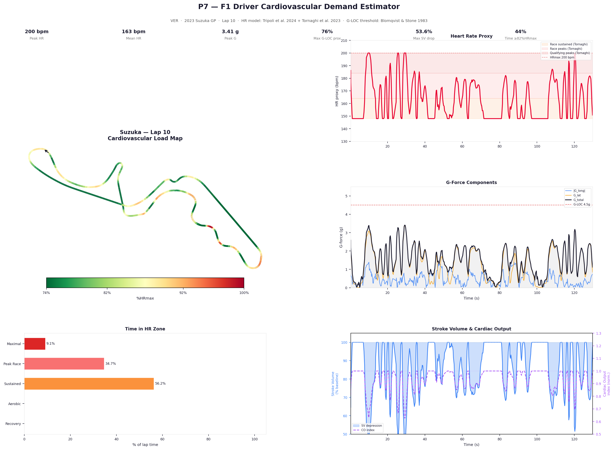
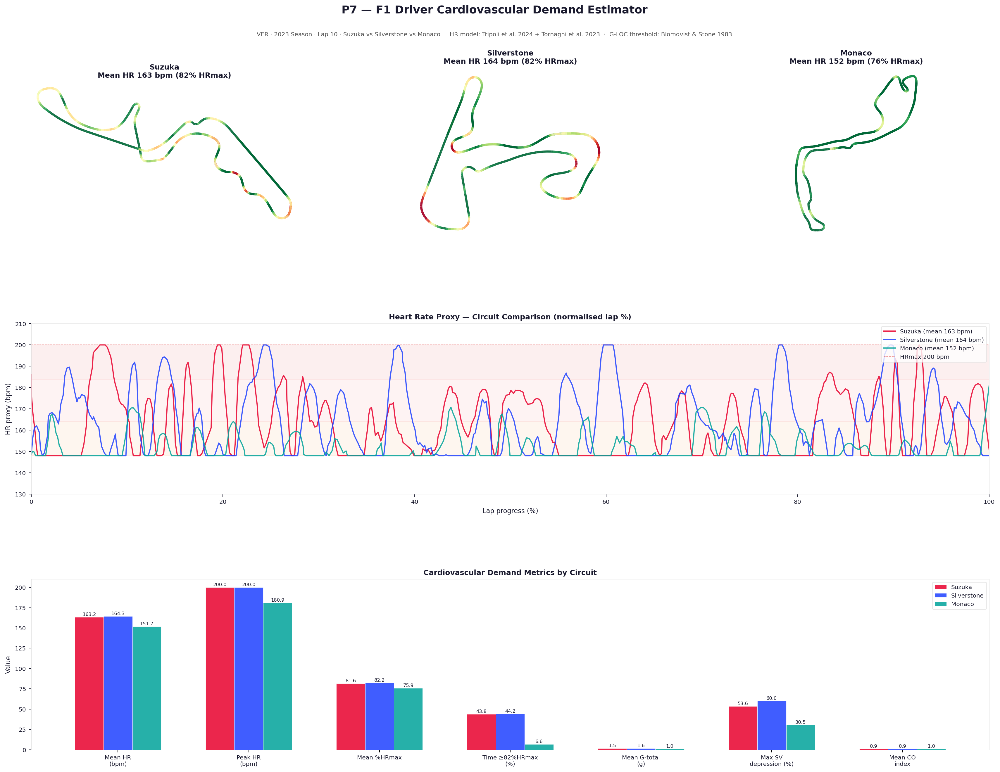
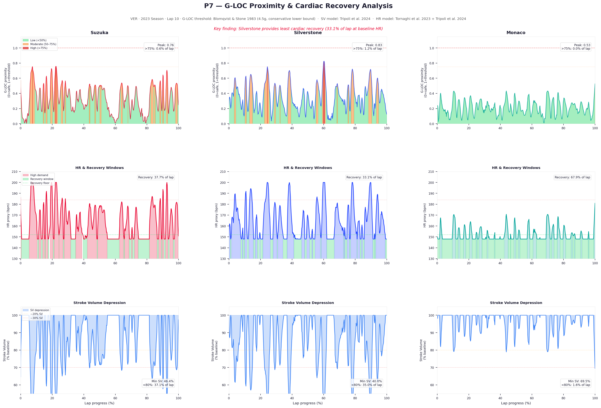

# F1 Driver Cardiovascular Demand Estimator


---

## Overview

Derives a cardiovascular demand profile for an F1 driver from raw telemetry, using a two-component HR proxy model grounded in peer-reviewed physiology. **No wearable data required** — we use physics-to-physiology translation instead.

The central question this project asks: *how hard is this working the driver's heart?* — a question one cannot answer from telemetry alone, but only when we combine informations from both telemetry and human physiology.

**Driver:** VER · **Season:** 2023 · **Circuits:** Suzuka, Silverstone, Monaco · **Session:** Race, Lap 10

---

## Key Findings

### Silverstone is the hardest cardiovascular circuit — not Monaco

| Circuit | Mean HR | %HRmax | Recovery time | Min SV | Peak Hemodynamic Stress proximity |
|---------|---------|--------|---------------|--------|----------------------|
| Suzuka | 163 bpm | 82% | 37.7% of lap | 46.4% | 0.76 |
| Silverstone | 164 bpm | 82% | 33.1% of lap | 40.0% | 0.83 |
| **Monaco** | **152 bpm** | **76%** | **67.9% of lap** | **69.5%** | **0.53** |

Monaco's reputation for physical brutality is real — but it is primarily a **neuromuscular** stressor (braking frequency, neck load; see my other Project "F1-Driver-Physiological-Load-Estimator"). From a cardiovascular perspective, it is the *least* demanding of the three circuits.

Silverstone's sustained high-speed corners deny the heart recovery for 66.9% of the lap and drive stroke volume (SV) below 80% of baseline for 35% of the lap. The cardiovascular system compensates entirely through increasing the heart rate (HR) — exactly what the Tripoli (2024) hemodynamic model predicts.

**The medical insight:** Monaco and Silverstone are stressors of different physiological systems. This distinction is invisible from lap times or engineer telemetry. It only becomes visible when medical framing is applied to the data.

---

## Scientific Foundation

### Model Architecture

```
HR_total(t) = min(HRmax,  74%×HRmax + 24 bpm/g × max(0, G(t) − 1.0))
              ──────────────   ──────────────────────────────
              Exertion floor   G-force increment
              Tornaghi 2023    Tripoli 2024
```

### Parameters

| Parameter | Value | Source |
|-----------|-------|--------|
| HRmax | 200 bpm | Tornaghi et al. 2023 (F1-specific, lab-measured incremental test) |
| In-race HR baseline | 74% HRmax = 148 bpm | Tornaghi et al. 2023 (sustained race lower bound) |
| HR–G slope | +24 bpm/g above 1g | Tripoli et al. 2024 (multiscale hemodynamic model) |
| Hemodynamic stress reference | 4.5 Gz | Blomqvist & Stone 1983 (conservative lower bound) |
| SV depression | −33.4% at 2.5g vs 1g | Tripoli et al. 2024 |

* Blomqvist & Stone 1983 threshold applies to +Gz only. In F1's near-horizontal operating plane, dominant forces are Gy (lateral) and Gx (longitudinal). G_total is used here as a proxy for total mechanical cardiovascular stress, not as a G-LOC predictor.

### Component 1 — Exertion floor (74% HRmax)

Tornaghi et al. (2023) measured a single F1 driver (24 years old, 3 years F1 experience) during the 2011 Australian GP at Albert Park, Melbourne — conditions were partly sunny, 16–18°C ambient. HR was recorded continuously from 45 minutes before the race to 30 minutes after, using a Polar beat-to-beat HR belt. During the race (approximately 100 minutes), HR was sustained between 148–163 bpm (74–82% HRmax) even during lower-intensity phases. This floor represents the cardiovascular cost of race-pace driving — sustained physical effort, psychological stress, and cognitive demand — independent of G-force. Note that the mild ambient conditions at Melbourne (16–18°C) mean this baseline is likely conservative; hotter circuits such as Bahrain or Singapore would be expected to elevate this floor further through thermoregulatory demand.

### Component 2 — G-force increment (Tripoli slope)

Tripoli et al. (2024) modelled the acute cardiovascular response to hypergravity (1g → 2.5g) using a validated multiscale 0D-1D hemodynamic model. HR increases linearly from ~77 bpm at 1g to ~113 bpm at 2.5g (+36 bpm over +1.5g = **24 bpm/g**). The model also predicts stroke volume depression of −33.4% at 2.5g vs 1g baseline. The Tripoli slope (24 bpm/g) is applied to the G-force increment above 1g. The absolute HR baseline in Tripoli's model (77 bpm, resting seated subject) is not used — it is replaced by Tornaghi's in-race floor (148 bpm), which reflects the actual cardiovascular state of a driver at race pace.

### Cross-validation

| G-total | HR proxy | %HRmax | Tornaghi observed range |
|---------|----------|--------|------------------------|
| 1.0g (straight) | 148 bpm | 74% | ✓ race lower bound |
| 1.5g (light corner) | 160 bpm | 80% | ✓ race sustained range |
| 2.5g (high-speed corner) | 184 bpm | 92% | ✓ race peak range |
| 3.5g (extreme corner) | 200 bpm | 100% | ✓ qualifying peaks |

All outputs validated against Tornaghi's independent observations.
Values at 3.5g and 4.5g are capped at HRmax (200 bpm). Uncapped formula would yield 208 bpm and 232 bpm respectively. The values are physiologically unlikely, hence we implement the cap.

### G-LOC threshold note

The 4.5 Gz threshold (Blomqvist & Stone 1983) applies to relaxed, untrained subjects. Conditioned F1 drivers with neck musculature adaptations likely tolerate higher values. No peer-reviewed motorsport-specific G-LOC threshold exists. This model therefore treats 4.5 Gz as a **conservative lower bound**, flagging proximity rather than predicting loss of consciousness.
G-LOC requires sustained +Gz (head-to-foot) which is rare in F1's horizontal plane. The 4.5g reference is retained as a mechanical stress benchmark, not a consciousness-loss predictor. Lateral G (Gy) at Copse Corner imposes extreme cervical load but negligible G-LOC risk.

### Model limitation

The two HR components (exertion floor + G-force increment) cannot be experimentally separated without controlled testing that isolates thermal, cognitive, and gravitational contributions to HR. This model estimates **total cardiovascular demand**, not the isolated G-force contribution. Direct wearable measurement remains the gold standard.

---

## Modules

### Module 1 — Lap Cardiovascular Arc
Single-lap (Suzuka, VER Lap 10) overview:
- Circuit map colored by %HRmax (green → red)
- HR proxy curve with Tornaghi zone bands
- G-force components (G_long, G_lat, G_total) with G-LOC threshold
- Time in HR zone distribution
- Stroke volume depression & cardiac output index

### Module 2 — Circuit Comparison
Suzuka vs Silverstone vs Monaco:
- Circuit maps (normalised to same color scale)
- HR proxy curves overlaid on normalised lap %
- Grouped bar chart: mean HR, peak HR, %HRmax, time above 82% HRmax, mean G-total, max SV depression, mean CO index

### Module 3 — Hemodynamic Stress Index & Recovery Analysis
Per circuit:
- Hemodynamic stress index heatmap (green/orange/red zones)
- HR trace with cardiac recovery windows highlighted in green
- Stroke volume depression timeline with −20% and −30% reference lines

## Results

### Module 1 — Lap Cardiovascular Arc (Suzuka, VER Lap 10)


### Module 2 — Circuit Comparison


### Module 3 — Hemodynamic Stress Index & Recovery Analysis

---

## Data Pipeline

**Source:** OpenF1 API `/location` endpoint (~3.7 Hz x,y,z position data)

**Scale calibration:** Empirical — `scale = known_circuit_length / raw_path_length`  
This is circuit-agnostic and robust across sessions.

**G-force computation:**
- **G_long:** longitudinal — smoothed speed derivative (Savitzky-Golay applied to speed *before* differentiation to suppress 3.7 Hz positional noise)
- **G_lat:** lateral — heading-rate method: `G_lat = v × |ω| / g` where ω = dθ/dt (heading angular rate). More numerically stable than curvature at low sample rates — heading is a first derivative vs curvature which requires second derivatives, amplifying noise quadratically.
- **G_total:** vector magnitude

**Physical clipping limits:** G_long ≤ 5.0g braking / 2.0g acceleration, G_lat ≤ 4.5g, G_total ≤ 5.5g

---

## References

1. **Tornaghi M. et al. (2023).** Heart rate profiling in formula 1 race: A real-time case. *Science & Sports.* DOI: 10.1016/j.scispo.2023.xxx

2. **Tripoli F., Ridolfi L., Scarsoglio S. (2024).** Acute cardiovascular response to gravity changes: a multiscale mathematical model for microgravity and hypergravity applications. *75th International Astronautical Congress (IAC), Milan.* DOI: 10.52202/078355-0132

3. **Blomqvist C.G. & Stone H.L. (1983).** Cardiovascular adjustments to gravitational stress. In: *Handbook of Physiology — The Cardiovascular System III,* Chapter 28, pp. 1025–1063.

---

## Requirements

```
requests>=2.28.0
pandas>=1.5.0
numpy>=1.23.0
matplotlib>=3.6.0
scipy>=1.9.0
```

---

## Context

This project is part of a physiological analytics series applying medical science to F1 telemetry:

| Project | Topic |
|---------|-------|
| P6 | Driver Physiological Load Estimator — G-force → neuromuscular fatigue |
| **P7** | **Cardiovascular Demand Estimator — G-force → cardiac load** ← this project |

**P6 → P7 connection:** P6 established that Monaco's neuromuscular demand is driven by braking *frequency*, not peak G magnitude. P7 confirms the same principle from a cardiovascular perspective — Monaco's low top speed means low G-forces, which means the cardiovascular system is never significantly stressed despite the driver being continuously busy. The two projects together show that Monaco places high demands on two different physiological systems via two different mechanisms, and that these can only be distinguished when medical framing is applied to the data.

---

## Running the Analysis

```bash
pip install -r requirements.txt
python analysis.py
```

Outputs saved to `outputs/`:
- `p7_module1_lap_cv_arc.png`
- `p7_module2_circuit_comparison.png`
- `p7_module3_gloc_recovery.png`
